# VRacer
## Team members
Team Advisor: Dr. Jillian Aurisano  
Binh Luong, Shane Reilly, Ryan Richter, Jack Riley, Hao Truong  
## Project Abstract
VR is a modern technology with a heap of untapped potential. It has been implemented heavily in the medical and entertainment sectors but one place where it has been relatively neglected is the military field. We saw an opening in one particular place that aligned with our groups’ interest, and that was the potential that VR had in coordination with remote vehicles. Remote vehicles are a relatively recent development in military operations, but we believe that its pairing with VR would be particularly useful for reconnaissance and intelligence. Of course, before becoming advanced enough to be used in the military, it must be useful in a practical sense. We aim to build a sort of prototype for a connection between a VR glove and a remote control car. The car will be controlled by hand gestures that will enable the user to take complete control of the car and its movements. We believe that this control scheme will allow for more fluid movement and intuitive control of the car. Further modifications to the design would be a camera attached to the car that allows the user to see the surroundings of the car in real time, and implementing a headset connection with the camera. We believe that this technology can be greatly beneficial in a variety of sectors, not limited to military.

## Project Description
Create a RC car that is controlled by VR hand gloves
The goal is to be able to control the car through hand gestures (forward, backward, turn)
If the goal is met before the deadline, further additions can be added, such as building a 360 degree camera and linking the glove with a VR headset

## User Stories and Design Diagrams
### User Stories 
- As a recon team member, I want to be able to clear a building or room silently without risking my team member or my life
- As a military officer, I want the RC car to have a stable connection, so that we can limit the risks of a dangerous operation
- As a troop without piloting or video game experience, I want the RC car to be controlled using a VR glove, so that I can learn quickly through natural motions
- As a field-based operator, I want the RC car to be very quiet if not silent, so that I am not exposed though noise when the car is scouting
- As a task force leader, I want the car to be able to cover rough terrain, so that I can use it in many different environments
### Design Diagrams

Level 1  

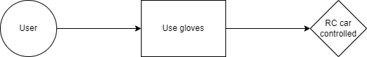

Level 2  

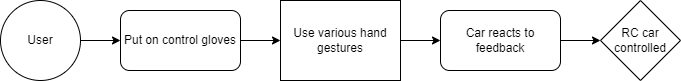

Level 3  

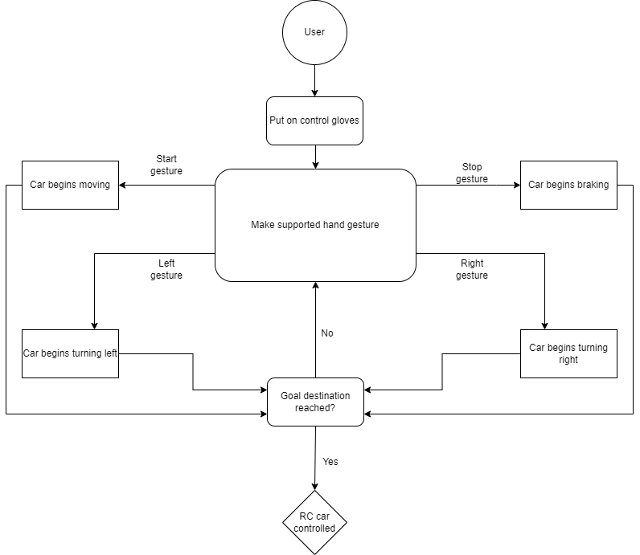

Description of the Diagrams: including conventions and a brief description of the purpose of each component.

## Project Tasks and Timeline
Task List
-Understand communication protocols between controller and RC car
-Build VR gloves that convert hand gesture input to car movements output
-Add haptic to VR gloves for better feeling/control to RC car
-Create a transmitter for VR gloves to transmit input to RC car
-Create a received to receive input from VR gloves on RC car
-Test RC car
-Add 360-degree camera on RC car
-Connect camera to VR goggle
-Test camera
Timeline

| Task | Assignee | Start  |  Complete | 
|-------------------------------------------------------------------------|---------------|------------|------------|
| Design 3D VR gloves                                                     | Binh Luong    | 10/1/2022  | 11/10/2022 |
| Assemble 3D VR gloves                                                   | Binh Luong    | 11/10/2022 | 11/25/2022 |
| Research how to build RC car                                            | Jack Riley    | 10/1/2022  | 10/25/2022 |
| Build the RC car                                                        | Jack Riley    | 10/25/2022 | 11/10/2022 |
| Conduct tests of vehicle                                                | Jack Riley    | 11/10/2022 | 12/1/2022  |
| Research how to connect VR gloves with RC car                           | Hao Truong    | 10/1/2022  | 11/20/2022 |
| Create a transmitter for VR gloves to transmit input to RC car          |               |            |            |
| Build a receiver for RC car                                             | Shane Reilly  | 10/1/2022  | 11/20/2022 |
| Understand communication protocols between controller and RC car        |               |            |            |
| Create a received to receive input from VR gloves on RC car             |               |            |            |
| Conduct tests of communication protocol                                 | Shane Reilly  | 11/20/2022 | 12/15/2022 |
| Create list of potential hand gestures for controlling RC car           | Ryan Ritcher  | 10/1/2022  | 11/20/2022 |
| Build VR gloves that convert hand gesture input to car movements output |               |            |            |
| Conduct tests of gloves                                                 | Binh Luong    | 11/25/2022 | 12/15/2022 |
| Test RC car                                                             |               |            |            |
| Design 360 camera for RC car                                            | Binh Luong    | 12/15/2022 | 1/1/2022   |
| Add 360-degree camera on RC car                                         |               |            |            |
| Design a receiver for camera and VR google                              | Shane Reilly  | 12/15/2022 | 1/1/2023   |
| Connect camera to VR goggle                                             |               |            |            |
| Test camera control                                                     | Ryan Ritcher  | 11/20/2022 | 12/1/2022  |
| Test camera                                                             |               |            |            |
| Design a suspension system for smoother drive                           | Jack Riley    | 12/1/2022  | 1/1/2023   |
| Configure haptic sensors for VR gloves                                  | Hao Truong    | 11/20/2022 | 12/20/2022 |
| Add haptic to VR gloves for better feeling/control to RC car            |               |            |            |
| Configure hand gestures base on trials                                  | Ryan Ritcher  | 12/1/2022  | 12/20/2022 |
| Document proper use of gloves and RC car                                | Ryan Ritcher  | 12/20/2022 | 1/15/2023  |

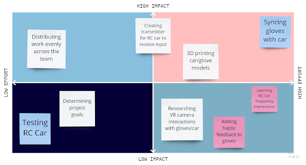
## ABET Concerns Essay (optional)
## PPT Slideshow (includes ABET Concerns)
## Self-Assessment Essays
### Hao Truong
For senior design project, me and my team decided to make a RC car that we can
controlled through VR hand gloves. Instead of using joystick on the usual controller, we can use
hand gestures to control the car. Further along the road, we want to be able to build a 360 camera
on the car and link it to VR headset. This will allow user to see what is in front of the car. As
computer science major, I mostly learn about algorithm and data structures of a computer. I want
to have a project that challenge me and more hand-on than learning it through books.
I learned about operating system, data structures, algorithms to write better code. It was
great to learn about how computer work. But I did not get to do a lot of practice or any project
that have a real-life value. I think not a lot of what I learned during my first three years is useful
for me to find a job at entry level. The last two years are better because I had a chance to pick
what class I want to take as elective. Most of the elective classes for 4th and 5th year requires
more hand-on and critical thinking. I think it is very useful. This project will be a good
opportunity for me to learn more about new technologies that I did not get to learn during many
classes I have taken.
I did all my co-ops at Fox Sports Cincinnati. At the first three co-op semesters, I worked
mostly with designing test cases for Fox Sports website. I think this will help a lot during testing
the project. I learned more about edge cases and small details that would affect user experience. I
spent my last two co-ops as software developer for backend team who supports data for Fox
Sports front end. I learned a lot about writing better, cleaner code. Since I will be working with
my teammates for the project, I think it is a good practice to keep the code base clean and easy to
read.
I think this project will be very interesting to work on because it is challenging to do. If
we can control a RC car with a hand gesture, that would open up many applications. It would be
a nice entertaining device. Moreover, we can use the same technology to design special vehicle
for emergency where we will able to reach many location where we could not reach before. I am
excited to work on this project, because I have never done development on VR. So I think it will
be a great experience.
My role in the project would be heavily focused on making connection between the RC
car and VR hand gloves. Our first approach is using Bluetooth, it would work great at close
range but would not work if the car goes out of range. We are planning on using maybe a Wi-Fi
hotspot, which could provide a better range but the tradeoff is higher latency. If I can create a
way to connect them together, I think I would do a good job at that point.

### Jack Riley
[CS Ind Capstone.docx](https://github.com/shanereilly/VRacer/files/10137571/CS.Ind.Capstone.docx)

### Shane Reilly
[reillysp_capstone_assessment.docx](https://github.com/shanereilly/VRacer/files/10137577/reillysp_capstone_assessment.docx)

## Professional Biographies
### Shane Reilly
 
#### Contact Information
Email: `reillysp@mail.uc.edu`
 
#### Co-op Work Experience
*Radiance Technologies*, Reverse Engineer Co-op 
January 2020 - January 2021
- Conducted reverse engineering efforts on firmware and operating system of critical infrastructure.
- Reverse engineering of unknown network protocols.
- Developed Ghidra plugins to assist in reverse engineering efforts.
 
Skills used: Ghidra, Java, Python, GDB debugger, Wireshark
 
*University of Cincinnati*, Research Assistant
May 2021 - December 2021
- Assisted in research using deep neural networks to analyze encrypted Amazon Alexa network traffic
- Aided in research with deep neural networks and side channel attacks on embedded devices using the ChipWhisperer platform.
 
Skills used: Python, Tensorflow, Raspberry Pi, ChipWhisperer, side channel attacks, FPGAs, ANTLR, 
 
*CADTalk*, Software Engineer Co-op
December 2021 - Present
- Troubleshooting and fixing bugs.
- Developing new integrations from existing CADTalk Framework to other CAD and ERP platforms.
- Wrote tests to ensure long-term resilience of code.
 
Skills used: C#, .NET, object-oriented programming, Moq testing framework.
 
 
#### Project Sought
I am most interested in security research, low level programming, embedded devices and/or software defined radio. I am looking for a project that is somewhat related to one of these.
 
### Jack Riley
 
#### Contact Information
Email: 'riley2jk@mail.uc.edu'
 
#### Co-op Work Experience
Front End Engineering Co-op
January 2022-Present
Fox Sports, Blue Ash, OH
- Utilized Vue, HTML, CSS, and JavaScript with no prior knowledge
- Created and developed several features to be added directly to foxsports.com
- Republished articles directly to the production site to eliminate 500 service errors
- Collaborated closely with senior and junior developers on my team and other teams to complete cross-functional tasks
- Fixed many bugs across the website across many different areas
 
Computer Engineering Co-op
Spring 2020, Fall 2020, Summer 2021
Signal X Technologies LLC, Plymouth, MI
- Designed software architecture and the GUI front-end user interface used by engineers and plant workers when operating a machine designed to test steering wheel columns
- Constructed and wired small scale panels from electrical drawings used in manufacturing plants
- Built and wired hardware placed in Pelican cases to be used for thermocouple-based testing. Responsible for final testing of functionality of each box before reaching the customer
- Wired large electrical panels from electrical drawings used in large NVH machines in automotive manufacturing plants
- Utilized LabVIEW and NI MAX to develop code for large machine operation
 
#### Project Sought
I am interested in anything related to the Computer Engineering field, whether it be Electrical or Computer Science focused. I am most interested in a project that combines both fields.
 
### Hao Truong
 
 
#### Contact
- truonganhhao26@gmail.com
- 513-668-0093
  
***
 
#### Co-op Experience
 
| Co-op Year | Job Title | Company  |  Duration | Technical skills | 
| :--------: | :-------: | :------: | :-------: | :--------------: |
| 1 - 2 - 3  | Software Test Engineer | Fox Sports | Jan 2020 - Jan 2022 | C#, Javascript, Automated tests with Selenium, Cypress, Documenting |
| 4 - 5      | Software Developer | Fox Sports | Jan 2022 - August 2022 | C#, .NET, SSMS, SQl, JSON serialization, Ingesting and exposing data from SSMS to API, Creating data model | 
 
#### Project Sought
 
Something involving web and app development in general.
 
### Ryan Richter
 
#### Contact
richter.w.ryan@gmail.com
513-400-8615
 
 
#### Co-op Experience
Software Engineer, FOX Sports, January 2020 - August 2022

Technical Skills: C#, Visual Studio, API Development

Non-technical: Work presentation, Sprint planning/execution
 
#### Project Sought
My team and I are seeking an app or web solution to a problem. Since we met at FOX Sports, we are potentially seeking something that can help us in our development at FOX. We worked a lot with sports data and odds, so perhaps something to do with that. 

### Binh Luong
 
#### Contact
luongbt@mail.uc.edu
513-400-0793
 
 
#### Co-op Experience
Backend QA Software Engineer, FOX Sports, January 2020 - Present

Technical Skills: C#, JavaScript, Automated Testing with Postman and Selenium, Azure DevOps.

Non-Technical: Research and Implementation
 
#### Project Sought
Anything within my field of study in computer engineering, whether it is hardware or software, I am interested in trying and learning new things.

    
## Budget
| Quantity | Part | Price | Total |
| :------: | :--: | :----:| :---: |
| 3 | DEERC DE45 RC Car | 29.99 | 89.97 |
| 1 | NRF24L01+PA+LNA Wireless Transceiver Module | 13.99 | 13.99 |
| 1 | ESPS32S ESP32 Development Board | 14.99 | 14.99 |
| 1 | TWTADE 10pcs single linear rotary seal amplifier potentiometers | 12.66 | 12.66 | |
| 1 | 10 Pcs MG90S geared micro servo motors | 31.99 | 31.99 |
| 1 | Qibaok crimping tool kit | 36.99 | 36.99 |
| 1 | 50 Pcs Retractable badge reel clips | 16.95 | 16.95 |
| 1 | Portable Chargers, 2-pack  | 29.96 | 29.96 |
| 1 | TRIBE Water Resistant cell phone armband case | 14.98 | 14.98 |
 
## Appendix
include appropriate references, citations, links to code repositories, and meeting notes.
there should be evidence justifying 45 hours of effort for each team member.

### Referenced Repositories

### Images

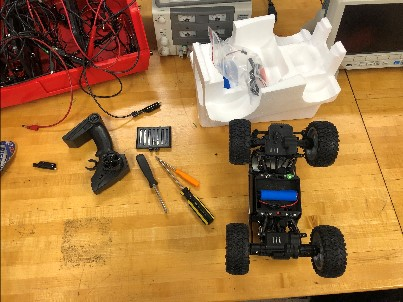 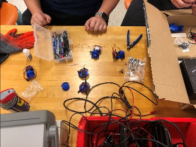 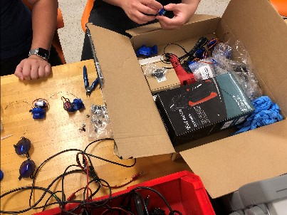 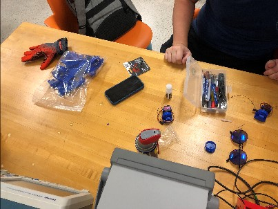 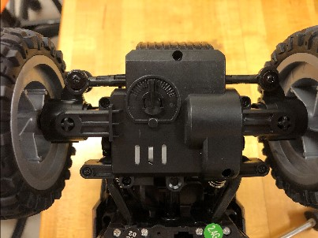
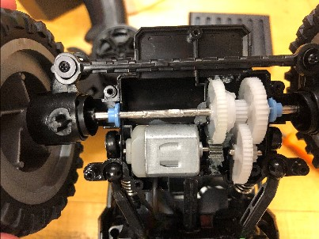 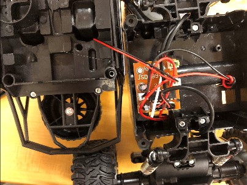 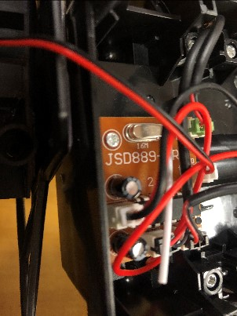 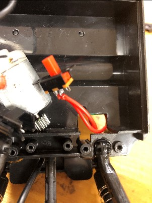
